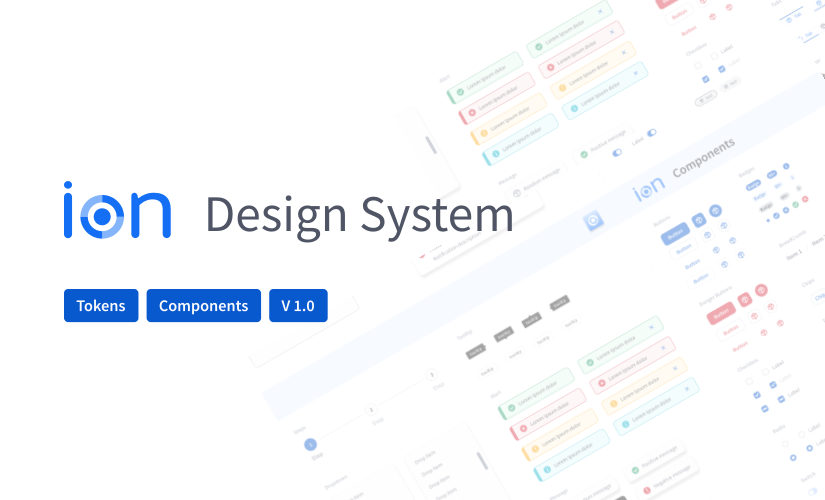

<b>React Version</b>

## Storybook

[Storybook](https://storybook.js.org/) is a component development tool that allows you to visualize and test components in isolation. This makes it easy to develop and test components, allowing you to see how they behave in different states and contexts.

### How to Run Storybook

- `yarn storybook`

This will start the Storybook server at http://localhost:6006 and you will be able to view your components in a friendly interface.

## Commit pattern

Commits should follow the [convention](https://conventionalcommits.org/).
We have the following types:

- feat: A new feature;
- fix: A bug fix;
- docs: Documentation only changes;
- style: Changes that do not affect the meaning of the code (white-space, formatting, missing semi-colons, etc);
- refactor: A code change that neither fixes a bug nor adds a feature;
- test: Adding missing tests or correcting existing ones;
- chore: Changes to the build process or auxiliary tools and libraries such as documentation generation;
- perf: A code that improves performance;
- ci: Changes to the CI/CD process;
- build: Changes that affect the build system or external dependencies (example scopes: gulp, broccoli, npm);
- temp: Temporary commits that won't be included in your CHANGELOG.

Example: `feat: add feature #issue_id`

## Deploy 🚀

<a href="https://main--63da5890a06a8f8f995110dd.chromatic.com"> Storybook </a>
